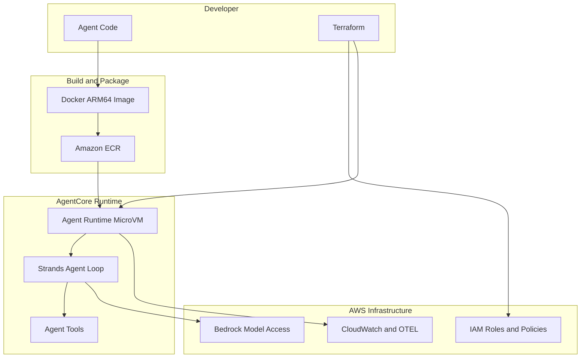

# Bedrock AgentCore Blueprint

A production-ready template for building AI agents with [Strands Agents SDK](https://strandsagents.com/) and deploying them to [Amazon Bedrock AgentCore Runtime](https://docs.aws.amazon.com/bedrock-agentcore/latest/devguide/what-is-bedrock-agentcore.html), with all infrastructure managed by [Terraform](https://www.terraform.io/).

## Architecture



## Project Structure

```
bedrock-agent-blueprint/
├── agents/                        # Agent code (what you edit)
│   ├── Dockerfile
│   ├── pyproject.toml
│   ├── uv.lock
│   ├── main.py
│   └── tools.py
│
├── infra/                         # Terraform (ECR, IAM, AgentCore Runtime)
│   ├── main.tf
│   ├── variables.tf
│   ├── iam.tf
│   ├── ecr.tf
│   ├── agent.tf
│   ├── outputs.tf
│   └── terraform.tfvars.example
│
├── scripts/
│   ├── build_and_push.sh
│   └── invoke.py
│
├── tests/
│   └── test_agent.py
│
├── .gitignore
└── README.md
```

## Prerequisites

- **AWS Account** with [AgentCore permissions](https://docs.aws.amazon.com/bedrock-agentcore/latest/devguide/runtime-permissions.html)
- **Python 3.10+** and [**uv**](https://docs.astral.sh/uv/)
- **Terraform >= 1.5**
- **Docker** (with buildx support) for building ARM64 images
- **AWS CLI** configured with credentials

### Using an AWS profile

Terraform uses the default AWS credential chain. To use a named profile from `~/.aws/credentials`:

```bash
export AWS_PROFILE=my-profile
terraform -chdir=infra plan
```

## Quick Start

### 1. Clone and deploy infrastructure

```bash
git clone <this-repo>
cd bedrock-agent-blueprint

# Configure infrastructure
cp infra/terraform.tfvars.example infra/terraform.tfvars
# Edit terraform.tfvars with your region, project name, etc.

cd infra
terraform init
terraform apply
cd ..
```

This creates the ECR repository, IAM roles, and the AgentCore runtime in one step.

### 2. Build and push the agent image

```bash
./scripts/build_and_push.sh
```

The script tags the image with the current git short SHA (e.g. `a1b2c3d`) and also pushes `latest`. It prints the exact `terraform apply` command at the end.

### 3. Deploy the updated image

```bash
# Use the tag printed by the build script
terraform -chdir=infra apply -var="container_tag=<git-sha>"
```

### 4. Invoke the agent

```bash
python scripts/invoke.py --prompt "What is the capital of France?"

# Or specify the ARN directly
python scripts/invoke.py \
  --arn "arn:aws:bedrock-agentcore:eu-west-1:123456789012:runtime/my-agent" \
  --prompt "What's the weather in Seattle?"
```

After making code changes, the typical workflow is just steps 2-3: rebuild the image, then `terraform -chdir=infra apply -var="container_tag=<new-sha>"`.

## Local Development

You can test the agent locally without deploying to AWS.

### Run the agent locally

```bash
cd agents
uv sync
uv run python main.py

# In another terminal:
curl -X POST http://localhost:8080/invocations \
  -H "Content-Type: application/json" \
  -d '{"prompt": "Hello!"}'
```

### Run the tests

```bash
cd agents
uv sync --dev
uv run pytest ../tests/ -v
```

The tests exercise tool functions directly — no AWS credentials needed.

## The Agent

The included agent (`agents/`) demonstrates custom tool integration using the Strands `@tool` decorator. It comes with three example tools:

- **`get_weather`** — Returns weather data for a city (mock, replace with a real API)
- **`calculate`** — Safely evaluates math expressions
- **`lookup_item`** — Searches a database by item ID (mock, replace with DynamoDB/RDS)

## Customization

### Add your own tools

1. Create a new function in `tools.py` (or a new file):

```python
from strands import tool

@tool
def my_tool(param: str) -> dict:
    """Description of what this tool does.

    Args:
        param: Description of the parameter.
    """
    return {"status": "success", "content": [{"text": do_something(param)}]}
```

2. Import and add it to the agent's `tools` list in `main.py`:

```python
from tools import my_tool

agent = Agent(
    tools=[my_tool],
    system_prompt="...",
)
```

### Change the model

The agent uses Claude Sonnet 4.5 via cross-region inference (`eu.anthropic.claude-sonnet-4-5-20250929-v1:0`) by default. To use a different model or region prefix, update `main.py`:

```python
from strands.models.bedrock import BedrockModel

model = BedrockModel(model_id="us.anthropic.claude-sonnet-4-5-20250929-v1:0")

agent = Agent(
    model=model,
    system_prompt="...",
)
```

### Switch to VPC networking

In `infra/terraform.tfvars`:

```hcl
network_mode = "VPC"
```

You will also need to add `subnets` and `security_groups` to the network configuration in `infra/agent.tf`.

### Add JWT authorization

Add an `authorizer_configuration` block to the runtime resource in `infra/agent.tf`:

```hcl
authorizer_configuration {
  custom_jwt_authorizer {
    discovery_url    = "https://accounts.google.com/.well-known/openid-configuration"
    allowed_audience = ["my-app"]
    allowed_clients  = ["client-123"]
  }
}
```

## Observability

The agent's Dockerfile includes `opentelemetry-instrument` which automatically sends traces and metrics to CloudWatch — no code changes needed.

To view your agent's observability data:

1. Enable [CloudWatch Transaction Search](https://docs.aws.amazon.com/bedrock-agentcore/latest/devguide/observability.html) (one-time setup)
2. Open the CloudWatch console
3. Navigate to **GenAI Observability** to see traces, metrics, and logs

## When To Use This Setup

**Use Strands + AgentCore Runtime when:**

- You want full control over agent reasoning
- You care about research-grade agent design
- You expect agents to evolve rapidly
- You still want serverless scaling, IAM, and observability

**Consider native Bedrock Agents instead if:**

- You want the simplest possible Bedrock-native agent
- You're fine with AWS-managed planning logic

## License

MIT
