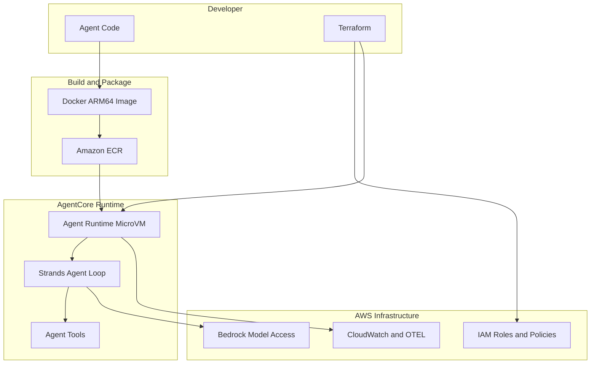

# Bedrock AgentCore Blueprint

A production-ready template for building AI agents with [Strands Agents SDK](https://strandsagents.com/) and deploying them to [Amazon Bedrock AgentCore Runtime](https://docs.aws.amazon.com/bedrock-agentcore/latest/devguide/what-is-bedrock-agentcore.html), with all infrastructure managed by [Terraform](https://www.terraform.io/).

## Architecture



**The three-layer mental model:**

| Layer | Responsibility | Analogy |
|-------|---------------|---------|
| **Strands SDK** | Agent reasoning, tool calling, memory | Philosophy of mind |
| **AgentCore Runtime** | Serverless execution, scaling, session isolation | Nervous system |
| **Terraform** | IAM, networking, runtime configuration | Constitution |

The handler that connects Strands to AgentCore is intentionally boring — if it grows beyond a thin adapter, you're doing it wrong.

## Project Structure

```
bedrock-agent-blueprint/
├── agents/
│   ├── simple/                    # Minimal "hello world" agent
│   │   ├── main.py               # BedrockAgentCoreApp + basic Agent
│   │   └── requirements.txt
│   │
│   └── tool_use/                  # Agent with custom tools
│       ├── main.py                # BedrockAgentCoreApp + Agent with tools
│       ├── tools.py               # @tool-decorated functions
│       └── requirements.txt
│
├── infra/
│   ├── main.tf                    # Provider config + AgentCore Runtime
│   ├── variables.tf               # Configurable inputs
│   ├── iam.tf                     # IAM roles and policies
│   ├── ecr.tf                     # ECR repository + lifecycle policy
│   ├── outputs.tf                 # Runtime ARN, ECR URI
│   └── terraform.tfvars.example   # Example variable values
│
├── Dockerfile                     # ARM64 container for AgentCore
├── scripts/
│   ├── build_and_push.sh          # Build + push Docker image to ECR
│   └── invoke.py                  # Test the deployed agent
│
├── tests/
│   └── test_agent.py              # Local tests (no AWS needed)
│
├── .gitignore
└── README.md
```

## Prerequisites

- **AWS Account** with [AgentCore permissions](https://docs.aws.amazon.com/bedrock-agentcore/latest/devguide/runtime-permissions.html)
- **Python 3.10+**
- **Terraform >= 1.5**
- **Docker** (with buildx support) for building ARM64 images
- **AWS CLI** configured with credentials

## Quick Start

### 1. Clone and configure

```bash
git clone <this-repo>
cd bedrock-agent-blueprint

# Set up Terraform variables
cp infra/terraform.tfvars.example infra/terraform.tfvars
# Edit infra/terraform.tfvars with your preferred region, agent name, etc.
```

### 2. Deploy infrastructure

```bash
cd infra
terraform init
terraform plan
terraform apply
cd ..
```

This creates:
- An ECR repository for your agent container
- An IAM role with permissions for ECR, Bedrock, and CloudWatch
- A Bedrock AgentCore Runtime pointing to the ECR image

### 3. Build and push the agent

```bash
# Deploy the simple agent
./scripts/build_and_push.sh agents/simple

# Or deploy the tool-use agent
./scripts/build_and_push.sh agents/tool_use
```

### 4. Update the runtime (if image changed)

```bash
cd infra
terraform apply
cd ..
```

### 5. Invoke the agent

```bash
python scripts/invoke.py --prompt "What is the capital of France?"

# Or specify the ARN directly
python scripts/invoke.py \
  --arn "arn:aws:bedrock-agentcore:us-east-1:123456789012:runtime/my-agent" \
  --prompt "What's the weather in Seattle?"
```

## Local Development

You can test the agent locally without deploying to AWS.

### Run the agent locally

```bash
cd agents/simple
pip install -r requirements.txt
python main.py

# In another terminal:
curl -X POST http://localhost:8080/invocations \
  -H "Content-Type: application/json" \
  -d '{"prompt": "Hello!"}'
```

### Run the tests

```bash
pip install pytest
pytest tests/ -v
```

The tests exercise tool functions directly — no AWS credentials needed.

## Example Agents

### Simple Agent (`agents/simple/`)

The absolute minimum: a Strands `Agent` with a system prompt, wired to AgentCore via `BedrockAgentCoreApp`. No tools, no memory — just a conversational agent. Start here to understand the wiring.

### Tool-Use Agent (`agents/tool_use/`)

A practical agent with three custom tools:

- **`get_weather`** — Returns weather data for a city (mock, replace with a real API)
- **`calculate`** — Safely evaluates math expressions
- **`lookup_item`** — Searches a database by item ID (mock, replace with DynamoDB/RDS)

This demonstrates how Strands handles tool calling: the agent decides when to call a tool, the tool runs, and the agent incorporates the result into its response.

## Customization

### Add your own tools

1. Create a new function in `tools.py` (or a new file):

```python
from strands import tool

@tool
def my_tool(param: str) -> dict:
    """Description of what this tool does.

    Args:
        param: Description of the parameter.
    """
    result = do_something(param)
    return {
        "status": "success",
        "content": [{"text": str(result)}],
    }
```

2. Import and add it to the agent's `tools` list in `main.py`:

```python
from tools import my_tool

agent = Agent(
    tools=[my_tool],
    system_prompt="...",
)
```

### Change the model

By default, Strands uses the default Bedrock model. To specify a different one:

```python
from strands.models.bedrock import BedrockModel

model = BedrockModel(model_id="us.anthropic.claude-sonnet-4-20250514")

agent = Agent(
    model=model,
    system_prompt="...",
)
```

### Switch to VPC networking

In `infra/terraform.tfvars`:

```hcl
network_mode = "VPC"
```

You will also need to add `subnets` and `security_groups` to the network configuration in `infra/main.tf`.

### Add JWT authorization

Add an `authorizer_configuration` block to the runtime resource in `infra/main.tf`:

```hcl
authorizer_configuration {
  custom_jwt_authorizer {
    discovery_url    = "https://accounts.google.com/.well-known/openid-configuration"
    allowed_audience = ["my-app"]
    allowed_clients  = ["client-123"]
  }
}
```

## Observability

The Dockerfile includes `opentelemetry-instrument` which automatically sends traces and metrics to CloudWatch — no code changes needed.

To view your agent's observability data:

1. Enable [CloudWatch Transaction Search](https://docs.aws.amazon.com/bedrock-agentcore/latest/devguide/observability.html) (one-time setup)
2. Open the CloudWatch console
3. Navigate to **GenAI Observability** to see traces, metrics, and logs

## When To Use This Setup

**Use Strands + AgentCore Runtime when:**

- You want full control over agent reasoning
- You care about research-grade agent design
- You expect agents to evolve rapidly
- You still want serverless scaling, IAM, and observability

**Consider native Bedrock Agents instead if:**

- You want the simplest possible Bedrock-native agent
- You're fine with AWS-managed planning logic

## License

MIT
