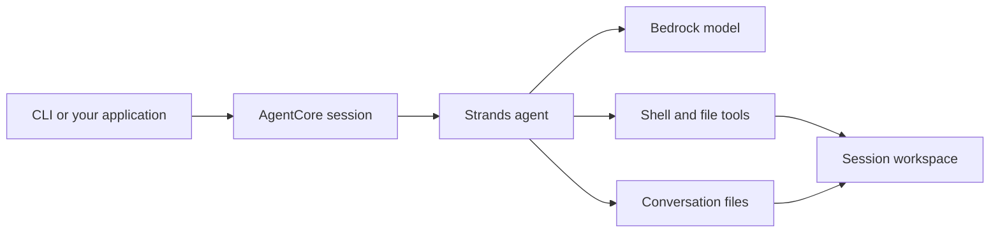

# Cloud Agent Workspace Blueprint

A small starting point for a general agent with its own remote Linux workspace. Give it a task, let it use files and commands, then reconnect to continue the work. Build on the template by changing the tools, instructions, model, or container image.

[Strands Agents](https://strandsagents.com/) runs the agent loop inside [Amazon Bedrock AgentCore Runtime](https://docs.aws.amazon.com/bedrock-agentcore/latest/devguide/what-is-bedrock-agentcore.html). Terraform provisions the runtime, ECR repository, and execution role in your AWS account.


```mermaid
flowchart LR
    CLI[CLI or your application] --> Runtime[AgentCore session]
    Runtime --> Agent[Strands agent]
    Agent --> Model[Bedrock model]
    Agent --> Tools[Shell and file tools]
    Tools --> Workspace[Session workspace]
    Agent --> History[Conversation files]
    History --> Workspace
```

## What you get

- An ARM64 container with Python, Bash, Git, Node.js, npm, and curl.
- Four readable tools: `run_shell`, `read_file`, `write_file`, and `list_files`.
- A workspace and conversation history that resume with the same session ID.
- A CLI to send tasks, continue sessions, list files, and download text artifacts.

For example, ask the agent to write a program and test it, inspect a public Git repository, or analyze data and save a report. Browser automation, a tool gateway, and a background task scheduler are possible extensions; they are not included.

## Deploy

You need Python 3.10+, [uv](https://docs.astral.sh/uv/), Terraform 1.5+, Docker with buildx, and an AWS CLI profile. Your AWS account needs AgentCore deployment permissions and access to the selected Bedrock model. Terraform uses AWS provider 6.46 or newer within major version 6.

From the repository root:

```bash
export AWS_PROFILE=your-profile
export AWS_REGION=eu-west-1

cp infra/terraform.tfvars.example infra/terraform.tfvars
# Edit aws_region, project_name, and model_id for your account.

uv sync --project agents --dev --frozen
./scripts/build_and_push.sh
terraform -chdir=infra apply -var="container_tag=<tag-printed-by-build-script>"
```

Use the same AWS region in your profile, environment, and Terraform configuration. The default model is [Claude Sonnet 5](https://docs.aws.amazon.com/bedrock/latest/userguide/model-card-anthropic-claude-sonnet-5.html), using `eu.anthropic.claude-sonnet-5`; choose an available model or inference profile when deploying elsewhere.

The build script initializes Terraform, provisions the ECR repository, builds the ARM64 image, and pushes a versioned tag plus `latest`. The default tag combines the Git SHA and build time; use `IMAGE_TAG` to supply your own. The final Terraform apply creates the runtime. For later changes, build again and apply with the new image tag.

When upgrading an existing checkout, run `terraform -chdir=infra init -upgrade` once to update the locked AWS provider before building. Remove obsolete `agent_memory_*` and `network_mode` settings from your `.tfvars` file. The next full apply removes any previously managed AgentCore Memory resources.

## Give the agent a task

The CLI reads the runtime ARN from Terraform output. Add `--arn <runtime-arn>` to call a runtime directly, or `--profile your-profile --region eu-west-1` to override your AWS configuration.

```bash
uv run --project agents python scripts/invoke.py \
  --prompt "Create a Python CSV summary tool and tests. Run the tests and save a short README."
```

Save the session ID printed by the command. Pass it again to use the same files and conversation:

```bash
uv run --project agents python scripts/invoke.py \
  --session-id <saved-session-id> \
  --prompt "Add an example CSV, run the tool on it, and save the output as summary.txt."

uv run --project agents python scripts/invoke.py \
  --session-id <saved-session-id> --list-files

uv run --project agents python scripts/invoke.py \
  --session-id <saved-session-id> \
  --download summary.txt --output ./summary.txt
```

Omitting `--session-id` for a prompt creates a new session. File operations require an existing session ID and do not invoke the model. `--list-files path/to/directory` lists a subdirectory; `--json` returns the full response. Downloads accept UTF-8 text files up to 1 MiB and never overwrite an existing local file.

## How sessions work

AgentCore provides an isolated runtime session and mounts managed session storage at `/mnt/workspace`. The application uses `WORKSPACE_DIR/<sha256-of-session-id>/` for working files and stores Strands conversation history in its `.conversation/` directory. Hashing keeps even maximum-length session IDs within filesystem limits. There is no AgentCore Memory resource or separate database.

Reuse the session ID to continue after the runtime compute stops. Managed session storage is currently **Preview**, expires after **14 days without an invocation**, and resets when the **runtime version changes**, including a deployment. Download deliverables before updating or deleting the runtime; these workspaces are not permanent backups. See [AWS filesystem lifecycle documentation](https://docs.aws.amazon.com/bedrock-agentcore/latest/devguide/runtime-filesystem-configurations.html).

The storage limit is **1 GB per session**, including dependencies, artifacts, and conversation history. See [AgentCore quotas](https://docs.aws.amazon.com/bedrock-agentcore/latest/devguide/bedrock-agentcore-limits.html).

## Execution boundaries

This is a starter for trusted callers. The runtime uses `PUBLIC` networking and IAM-authenticated invocation. A session ID selects a workspace; applications serving multiple users must control which sessions each user can access.

Shell commands run with the container's permissions and can access its runtime-role credentials and network. File-tool path checks catch mistakes; they do not restrict the shell. The system prompt asks for care with external writes, but model instructions are not a permission boundary. Keep the execution role limited to what your agent should be allowed to do. Local execution uses your machine's permissions and AWS credentials.

The implementation processes one request at a time per runtime process and returns a busy error for overlapping requests. Each shell call starts in the workspace, uses a fresh noninteractive Bash process, defaults to a 60-second timeout, and allows at most 120 seconds. Output is capped at 20 KB; background services are not supported. Larger jobs should be split into steps or handled by an extension you add.

File read/write tools accept UTF-8 files up to 1 MiB. Listings omit hidden files and symlinks and return up to 500 entries; the shell remains available for other filesystem operations.

## Run locally

The same agent can run without deploying infrastructure. Model requests still use Amazon Bedrock and your AWS credentials. Choose a local directory for the workspace:

```bash
AWS_PROFILE=your-profile AWS_REGION=eu-west-1 \
  WORKSPACE_DIR="$PWD/workspace" \
  uv run --project agents python agents/main.py
```

In another terminal, invoke it with a session header:

```bash
curl http://localhost:8080/invocations \
  -H 'Content-Type: application/json' \
  -H 'X-Amzn-Bedrock-AgentCore-Runtime-Session-Id: 12345678-1234-1234-1234-123456789012' \
  -d '{"prompt":"Write hello.py, run it, and save the output in hello.txt."}'
```

Reuse that header for follow-ups. The API also accepts `{"action":"list_files","path":"."}` and `{"action":"read_file","path":"hello.txt"}` for direct file retrieval. Without a header, local requests share the `local` session.

Run the tests and Terraform checks without AWS credentials:

```bash
uv run --project agents pytest tests/ -v
terraform -chdir=infra fmt -check
terraform -chdir=infra init -backend=false
terraform -chdir=infra validate
```

## Make it yours

| File | What to change |
| --- | --- |
| [agents/main.py](agents/main.py) | System prompt, model, tool registration, and request handling |
| [agents/tools.py](agents/tools.py) | Workspace tools and their limits |
| [agents/Dockerfile](agents/Dockerfile) | Programs available in the remote computer |
| [scripts/invoke.py](scripts/invoke.py) | CLI or an example for your own application |
| [infra/agent.tf](infra/agent.tf) | Runtime settings, storage, and environment variables |
| [infra/iam.tf](infra/iam.tf) | The runtime's AWS permissions |

To add a tool, add a method with the Strands `@tool` decorator to `Workspace` and register it in `create_agent()` in `agents/main.py`. Keep its docstring clear: the model uses it to understand when and how to call the tool.

To change the model, set `model_id` in `infra/terraform.tfvars`, or `MODEL_ID` when running locally. Install project dependencies inside the workspace so they survive a session restart. Keep changes to the base environment in the Dockerfile.

AgentCore captures runtime logs in CloudWatch. Tracing is an optional extension: follow [AgentCore observability setup](https://docs.aws.amazon.com/bedrock-agentcore/latest/devguide/observability.html) before adding OpenTelemetry instrumentation to the container.

## Optional GitHub Actions

[examples/github-workflows/](examples/github-workflows/) contains CI, deployment, and rollback examples. They are inactive until copied into `.github/workflows/` in your own repository.

For CI deployments, create an S3 state bucket, copy `infra/backend.tf.example` to `infra/backend.tf`, and initialize it with the configuration documented in that file. If you already deployed locally, migrate your existing state. Configure repository variables `AWS_REGION`, `TF_STATE_BUCKET`, and `TF_STATE_KEY`, plus the OIDC role secret `AWS_ROLE_TO_ASSUME`.

Terraform can create the starter OIDC role: set `github_actions_oidc_enabled = true`, configure `github_repository` and the state bucket/key variables, apply locally, and use the `ci_deploy_role_arn` output. Set `github_oidc_provider_arn` if the account already has a GitHub OIDC provider. Carry your Terraform deployment settings into CI so workflows use the same resource names, model, and OIDC settings. Keep `github_actions_oidc_enabled = true` in CI when using the managed role, or Terraform will plan to delete it.

The deployment example tests the code, builds the image, and applies Terraform. Rollback redeploys an existing ECR image tag; it also updates the runtime version and therefore resets session storage.

## Remove the deployment

Download any files you want to keep, then run:

```bash
terraform -chdir=infra destroy
```

This removes the runtime, its session storage, Terraform-managed roles, and the ECR repository. In non-production environments it also deletes stored images. With `environment = "prod"`, empty the ECR repository before destroying it. Separately managed resources such as your Terraform state bucket remain.

## License

MIT
